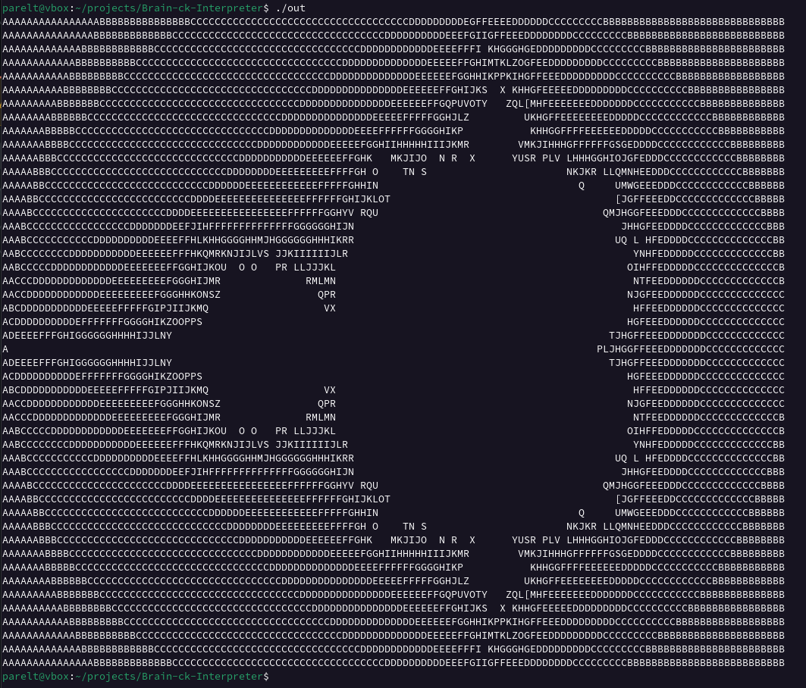

# Brain-ck-Interpreter
A compiler and interpreter for the Brainf*ck esoteric programming language.
This is based on the language design section described in the [Wikipedia article](https://en.wikipedia.org/wiki/Brainfuck).



## Building
Build the programs by running the `build.sh` shell script (Linux):

```bash
./build.sh
```

## Running

One may run either the compiler or the interpreter via two shell scripts at the root of the source code:

- compile.sh
- run.sh

`compile.sh` will invoke the compiler and `run.sh` will run the interpreter.

More information on these two options are described in the sections below.

Please note that running large Brainf*ck programs with the interpreter may be much slower
than compiling and running the same programs.

### Compiler

Brainf*ck code may be compiled down to assembly and/or an executable using the `gcc` C compiler.
Usage of the compiler assumes that the `gcc` command is already available on the system path.

To compile a program, run:

```bash
./compile -f ./myfile.bf
```

If the program can be compiled, resulting `out.c` and `out` files will be written to the directory of the invocation.
These two files are the C source code, and the binary executable resulting from the compiler invocation, respectively.

Optionally, one may also specify assembly output to the compile command:

```bash
./compile.sh -a -f ./myfile.bf
```

Selecting the option to generate the resulting assembly output will also trigger a full rebuild of the source code.

### Interactive interpreter
Run the interactive interpreter by running the `run.sh` shell script (Linux):

```bash
./run.sh
```

This will compile (if not already) the code in the project and start up an interactive Brainf*ck interpreter.

Once the interactive interpreter is running, you should see `BF(X)` in the terminal window.
The `X` is a numeric value indicating which data/cell the data pointer is currently pointing to.

Type "CTRL+C" or "CTRL+D" to exit the interactive interpreter at any time.

### Non-Interactive interpreter
You can also interpret files directly with:

```bash
./run.sh -f ./myfile.bf
```
